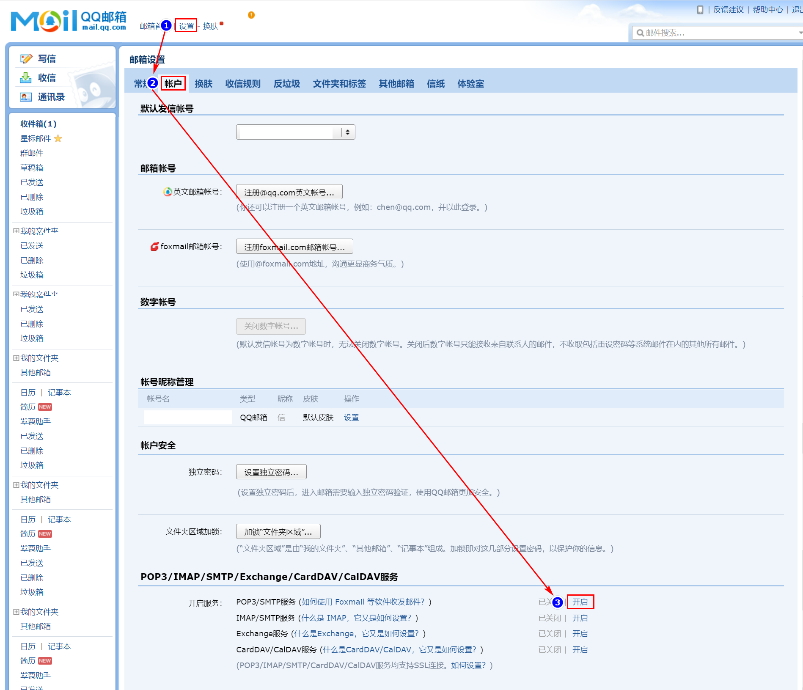
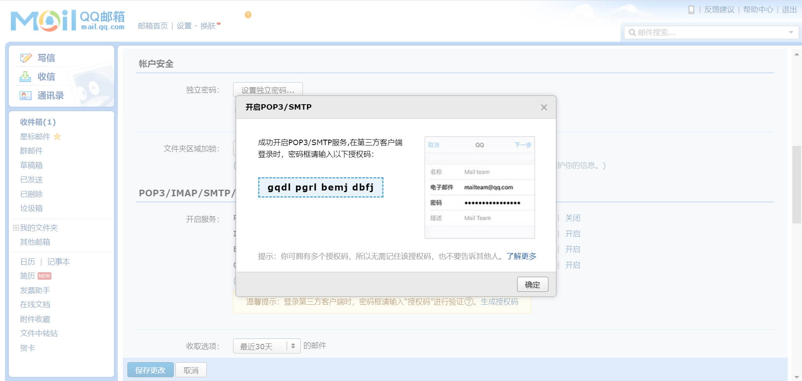
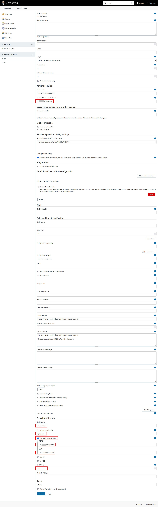
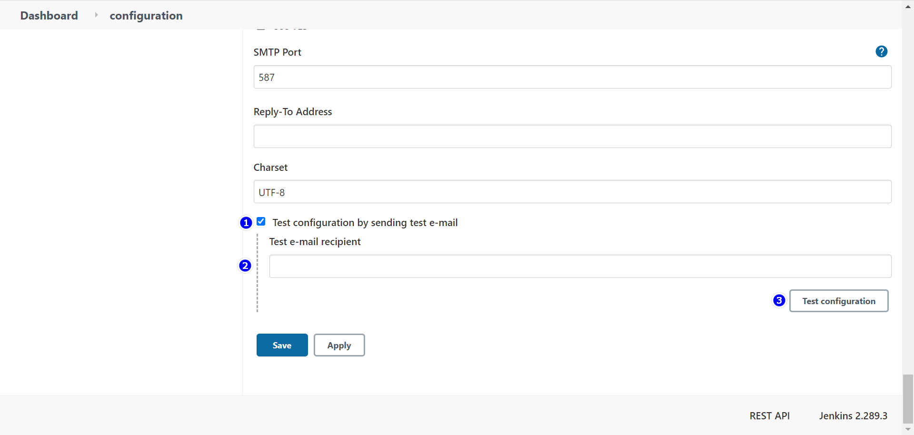
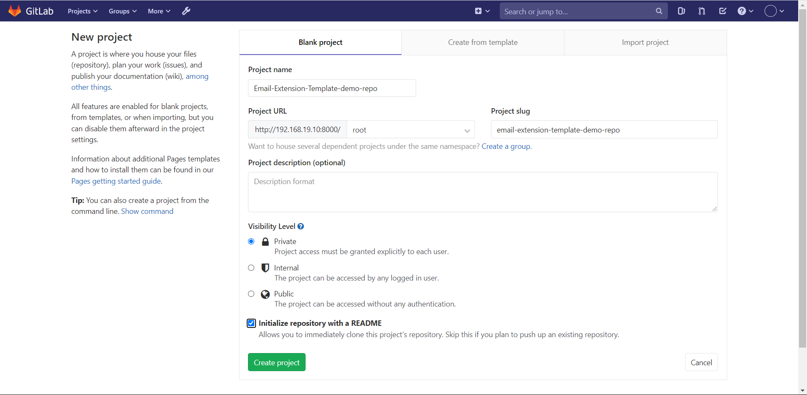
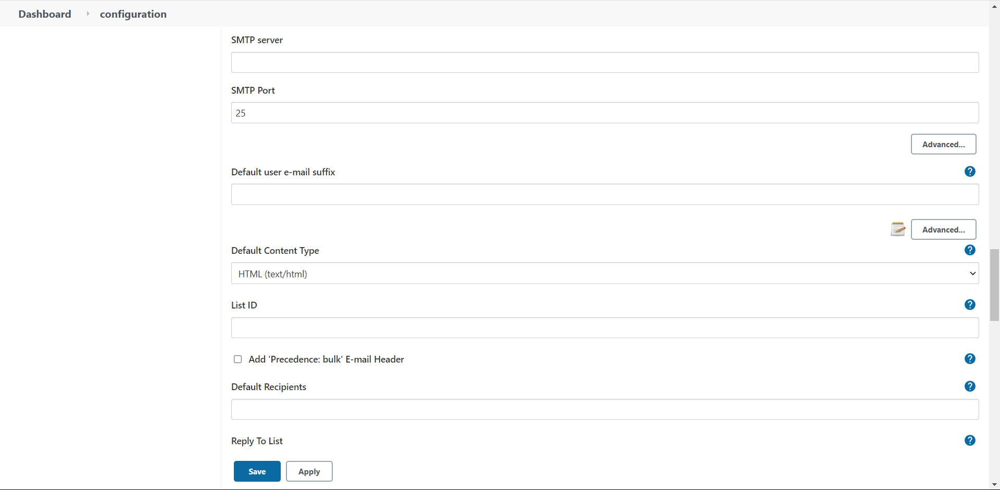

# 摘要

Jenkins 构建后发送邮件，这里使用 QQ 邮箱提供邮件服务

# 准备工作

## 实验条件

- jenkins-2.289.3 
- gitlab-ce_12.4.2-ce.0 
- [邮件授权码](#邮件授权码) 

## 前置知识

-  Jenkins 使用 pipeline clone gitlab 上的代码

# 邮件授权码

## 开启邮件服务



## 获取授权码



# jenkins 发送邮件

## 插件安装

| name                     | version |
| ------------------------ | ------- |
| Email Extension Template | 1.4     |

## Jenkins设置邮箱相关参数

进入 Manage Jenkins → Configure System ，设置如下参数：

| 配置项                           | 配置                     |
| -------------------------------- | ------------------------ |
| System Admin e-mail address      | ${你的邮箱}              |
| SMTP server                      | smtp.qq.com              |
| Default user e-mail suffix       | @qq.com                  |
| Use SMTP Authentication          | 勾选此项                 |
| Use SMTP Authentication → 用户名 | ${你的邮箱}              |
| Use SMTP Authentication → 密码   | ${授权码} 不是 QQ 密码！ |
| SMTP Port                        | 587                      |



## 测试

1. 点击 **Test configuration by sending test e-mail** 
2. 输入一个邮箱
3. 点击 **Test configuration** 

如果能够收到邮件，则说明配置成功



# 按照模板发送邮件

你可以在 Manage Jenkins → Configure System 中设置邮件发送的配置，比如何时发送邮件、发送邮件的模板。在这里我更推荐把邮件模板跟代码放在一起，然后使用 pipeline 控制邮件的发送

## gitlab

### 创建项目

创建项目 Email-Extension-Template-demo-repo



### 邮件模板

在仓库的根目录下新建 **jenkins-email-notification-template.html**  ，内容如下：

```html
<!DOCTYPE html>
<html>
  
  <head>
    <meta charset="UTF-8" />
    <title>
      ${ENV, var=&quot;JOB_NAME&quot;}-第${BUILD_NUMBER}次构建日志
    </title>
  </head>
  
  <body leftmargin="8" marginwidth="0" topmargin="8" marginheight="4" offset="0">
    <table width="95%" cellpadding="0" cellspacing="0" style="font-size: 11pt; font-family: Tahoma, Arial, Helvetica, sans-
    serif">
      <tbody>
        <tr>
          <td>
            (本邮件是程序自动下发的，请勿回复！)
          </td>
        </tr>
        <tr>
          <td>
            <h2>
              <font color="#0000FF">
                构建结果 - ${BUILD_STATUS}
              </font>
            </h2>
          </td>
        </tr>
        <tr>
          <td>
            <br />
            <b>
              <font color="#0B610B">
                构建信息
              </font>
            </b>
            <hr size="2" width="100%" align="center" />
          </td>
        </tr>
        <tr>
          <td>
            <ul>
              <li>
                项目名称&nbsp;：&nbsp;${PROJECT_NAME}
              </li>
              <li>
                构建编号&nbsp;：&nbsp;第${BUILD_NUMBER}次构建
              </li>
              <li>
                触发原因：&nbsp;${CAUSE}
              </li>
              <li>
                构建日志：&nbsp;
                <a href="${BUILD_URL}console">
                  ${BUILD_URL}console
                </a>
              </li>
              <li>
                构建&nbsp;&nbsp;Url&nbsp;：&nbsp;
                <a href="${BUILD_URL}">
                  ${BUILD_URL}
                </a>
              </li>
              <li>
                工作目录&nbsp;：&nbsp;
                <a href="${PROJECT_URL}ws">
                  ${PROJECT_URL}ws
                </a>
              </li>
              <li>
                项目&nbsp;&nbsp;Url&nbsp;：&nbsp;
                <a href="${PROJECT_URL}">
                  ${PROJECT_URL}
                </a>
              </li>
            </ul>
          </td>
        </tr>
        <tr>
          <td>
            <b>
              <font color="#0B610B">
                Changes Since Last Successful Build:
              </font>
            </b>
            <hr size="2" width="100%" align="center" />
          </td>
        </tr>
        编写Jenkinsfile添加构建后发送邮件
        <tr>
          <td>
            <ul>
              <li>
                历史变更记录 :
                <a href="${PROJECT_URL}changes">
                  ${PROJECT_URL}changes
                </a>
              </li>
            </ul>
            ${CHANGES_SINCE_LAST_SUCCESS,reverse=true, format=&quot;Changes for Build
            #%n:
            <br />
            %c
            <br />
            &quot;,showPaths=true,changesFormat=&quot;
            <pre>
              [%a]
              <br />
              %m
            </pre>
            &quot;,pathFormat=&quot;&nbsp;&nbsp;&nbsp;&nbsp;%p&quot;}
          </td>
        </tr>
        <tr>
          <td>
            <b>
              Failed Test Results
            </b>
            <hr size="2" width="100%" align="center" />
          </td>
        </tr>
        <tr>
          <td>
            <pre style="font-size: 11pt; font-family: Tahoma, Arial, Helvetica,
            sans-serif">
              $FAILED_TESTS
            </pre>
            <br />
          </td>
        </tr>
        <tr>
          <td>
            <b>
              <font color="#0B610B">
                构建日志 (最后 100行):
              </font>
            </b>
            <hr size="2" width="100%" align="center" />
          </td>
        </tr>
        <tr>
          <td>
            <textarea cols="80" rows="30" readonly="readonly" style="font-family: Courier New">
              ${BUILD_LOG, maxLines=100}
            </textarea>
          </td>
        </tr>
      </tbody>
    </table>
  </body>
</html>
```


## jenkins

### Default Content Type

进入 Manage Jenkins → Configure System ，设置 **Default Content Type** 为 **HTML(text/html)** ：



### 创建 pipeline 项目

```groovy

pipeline {
    agent any

    stages {
        stage('clone') {
            steps {
                checkout([$class: 'GitSCM', branches: [[name: '*/master']], extensions: [], userRemoteConfigs: [[credentialsId: '6eb76399-5a78-48a0-90dc-427141198d53', url: 'http://192.168.19.10:8000/root/email-extension-template-demo-repo.git']]])
            }
        }
    }
    post {
        always {
            emailext(
                subject: '构建通知：${PROJECT_NAME} - Build # ${BUILD_NUMBER} -${BUILD_STATUS}!',
                body: '${FILE,path="jenkins-email-notification-template.html"}',
                to: '3593141687@qq.com'
            )
        }
    }
}

```


