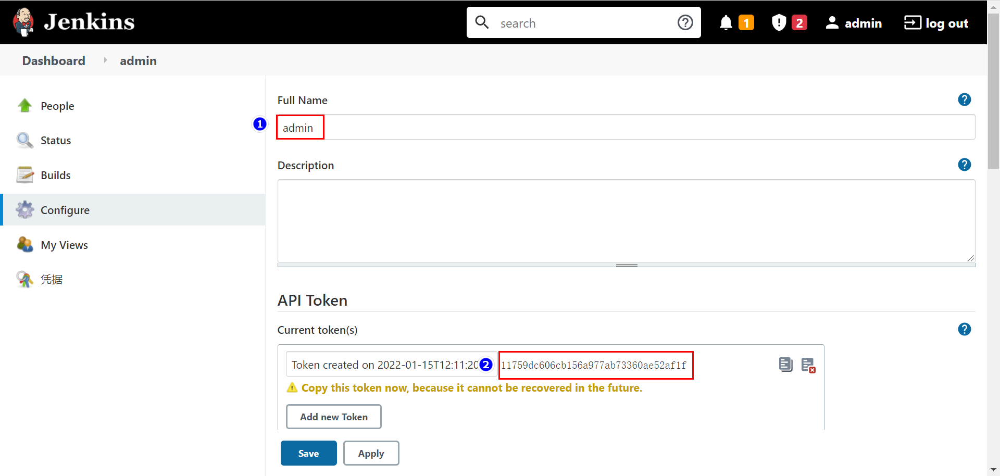

# 摘要

jenkins 自动构建

# 环境准备

- jenkins-2.289.3

# Jenkins

## 插件安装

| name                    | version |
| ----------------------- | ------- |
| Pipeline                | 2.6     |
| Generic Webhook Trigger | 1.79    |

## API Token

### 进入 Configure

### 生成 API Token

生成 API Token 后记住这两个值

