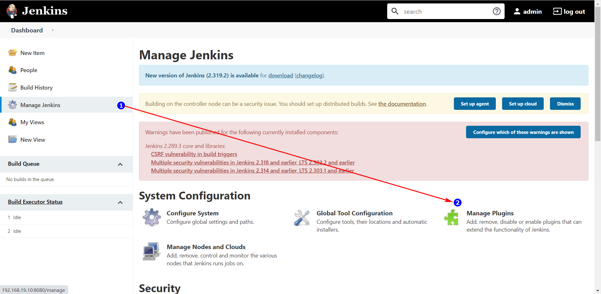
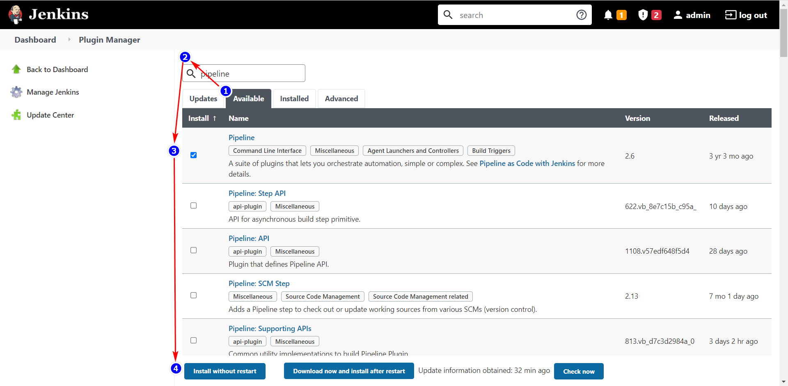
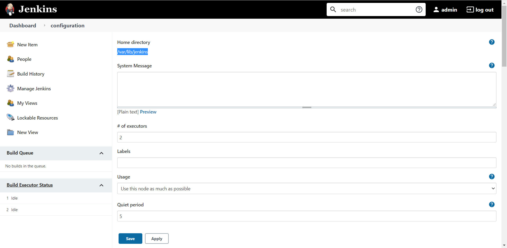
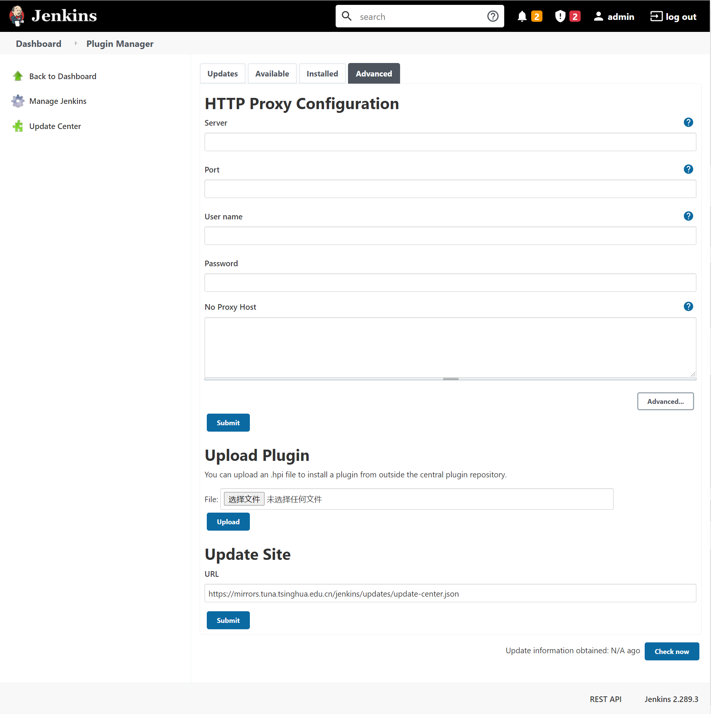

# 摘要

# Jenkins 安装插件的方法

## 通过管理界面安装

这是安装插件最简单的方法，但由于服务器在国外，很有可能因为网络原因下载失败

### 插件管理界面

Manage Jenkins → Manage Plugins 进入插件管理界面




### 安装

以安装 **pipeline** 为例：

1. 点击 Available 
2. 搜索框内搜索想要安装的插件，比如 pipeline
3. 选中想要安装的插件
4. 点击 **Install without restart** 按钮进行安装




## Jenkins 插件的迁移

### JENKINS_HOME 的位置

点击 Manage Jenkins → Configure System ，即可看见 **Home directory** ，下面的 **/var/lib/jenkins** 就是 `JENKINS_HOME` 



### jpi 文件 

`JENKINS_HOME/plugins` 文件夹下有一堆 jpi 文件，这些 jpi 文件就是 Jenkins 插件的安装包。我们把它下载下来，哪里需要安装插件就把它们传到哪里的  `JENKINS_HOME/plugins` 文件夹下，然后重启 Jenkins ，这样就安装好插件了

## jenkins-plugin-cli

[jenkins-plugin-manager-2.12.3.jar](https://github.com/jenkinsci/plugin-installation-manager-tool/releases/download/2.12.3/jenkins-plugin-manager-2.12.3.jar) | [下载页面](https://github.com/jenkinsci/plugin-installation-manager-tool/releases/tag/2.12.3) | [官网](https://github.com/jenkinsci/plugin-installation-manager-tool)

### 下载

```sh
# 找个地方放 jenkins-plugin-manager
cd /var/lib/jenkins/plugins
# 下载 jenkins-plugin-manager
wget https://github.com/jenkinsci/plugin-installation-manager-tool/releases/download/2.12.3/jenkins-plugin-manager-2.12.3.jar
```

### 测试

```sh
# 查找 jenkins.war 
find / -name jenkins.war
```

```sh
java -jar /var/lib/jenkins/plugins/jenkins-plugin-manager-2.12.3.jar --war /usr/lib/jenkins/jenkins.war --view-security-warnings --verbose --jenkins-update-center='https://mirrors.tuna.tsinghua.edu.cn/jenkins/updates'  --plugins gitlab-hook:1.4.2 -d /jenkins
```

## 下载加速

这里我们使用国内的镜像源，确保能够正常下载

```
# 修改前
https://updates.jenkins.io/update-center.json
# 修改后
https://mirrors.tuna.tsinghua.edu.cn/jenkins/updates/update-center.json
```



# 参考

 [10分钟教会你Jenkins数据迁移和备份.html](assets\references\10分钟教会你Jenkins数据迁移和备份.html) 

 [What is difference between .hpi and .jpi of Jenkins plugins.html](assets\references\What is difference between .hpi and .jpi of Jenkins plugins.html) 

[Managing Plugins](https://www.jenkins.io/doc/book/managing/plugins/) 

# 相关网站

 [清华大学开源软件镜像站-Jenkins](https://mirrors.tuna.tsinghua.edu.cn/jenkins/) 
