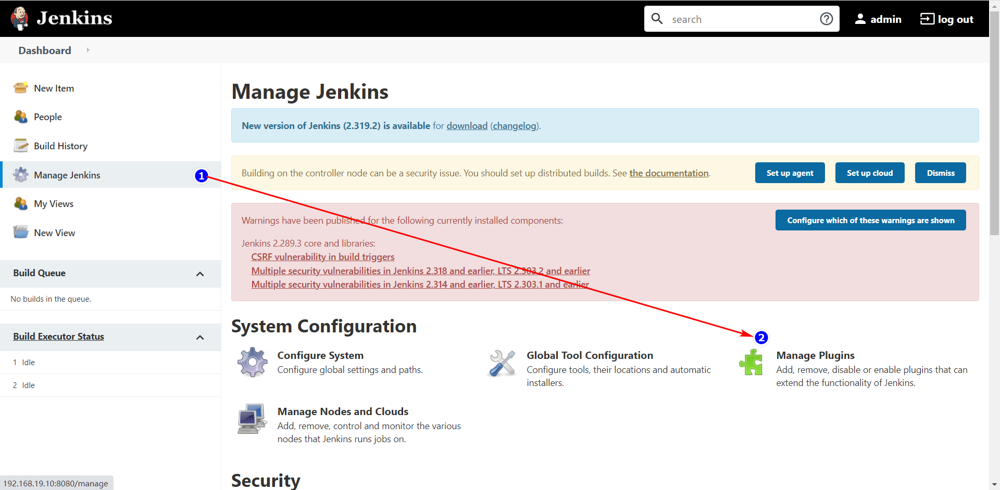
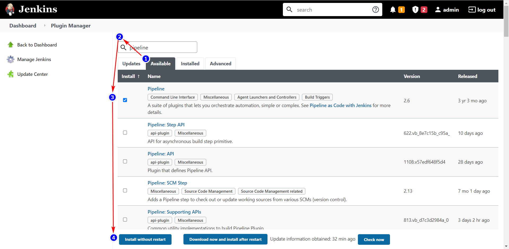

# 摘要

# Jenkins 安装插件的方法

## 通过管理界面安装

### 插件管理界面

Manage Jenkins → Manage Plugins 进入插件管理界面

### 安装

以安装 **pipeline** 为例：

1. 点击 Available 
2. 搜索框内搜索想要安装的插件，比如 pipeline
3. 选中想要安装的插件
4. 点击 **Install without restart** 按钮进行安装

# 参考

 [10分钟教会你Jenkins数据迁移和备份.html](assets\references\10分钟教会你Jenkins数据迁移和备份.html) 

