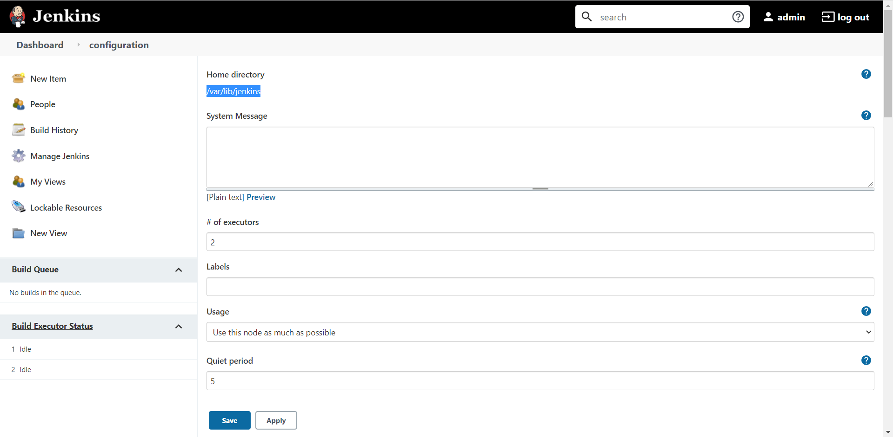

# 摘要

# Jenkins 安装插件的方法

## 通过管理界面安装

这是安装插件最简单的方法，但由于服务器在国外，很有可能因为网络原因下载失败

### 插件管理界面

Manage Jenkins → Manage Plugins 进入插件管理界面

### 安装

以安装 **pipeline** 为例：

1. 点击 Available 
2. 搜索框内搜索想要安装的插件，比如 pipeline
3. 选中想要安装的插件
4. 点击 **Install without restart** 按钮进行安装

## JENKINS_HOME/plugins/ 安装

这种适合以前已经装过了的情况

### JENKINS_HOME 的位置

点击 Manage Jenkins → Configure System ，即可看见 **Home directory** ，下面的 **/var/lib/jenkins** 就是 `JENKINS_HOME` 

# 参考

 [10分钟教会你Jenkins数据迁移和备份.html](assets\references\10分钟教会你Jenkins数据迁移和备份.html) 

 [What is difference between .hpi and .jpi of Jenkins plugins.html](assets\references\What is difference between .hpi and .jpi of Jenkins plugins.html) 

