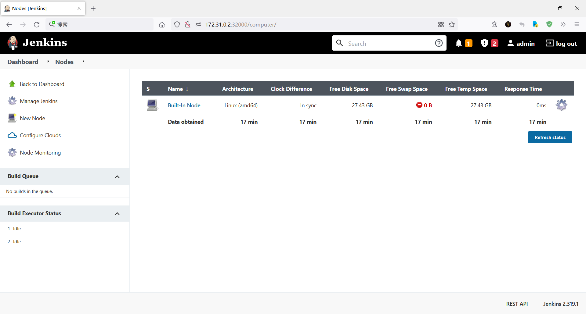
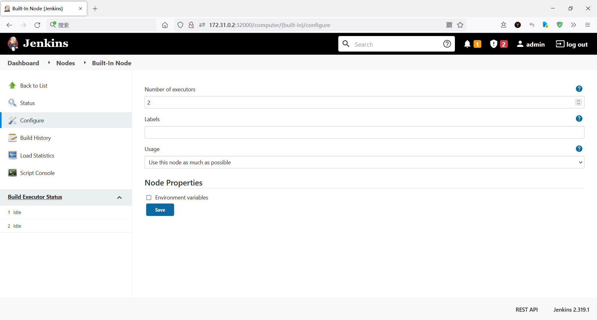
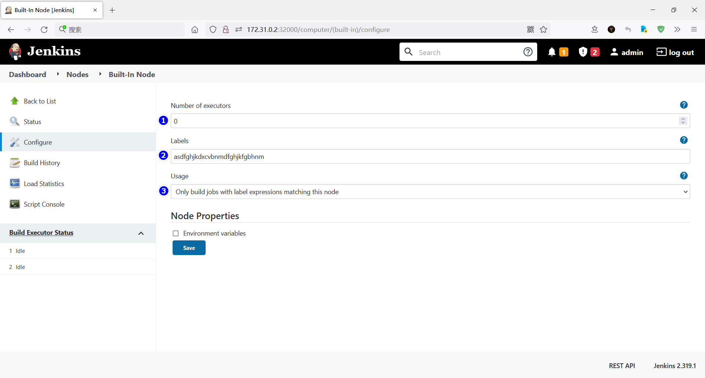
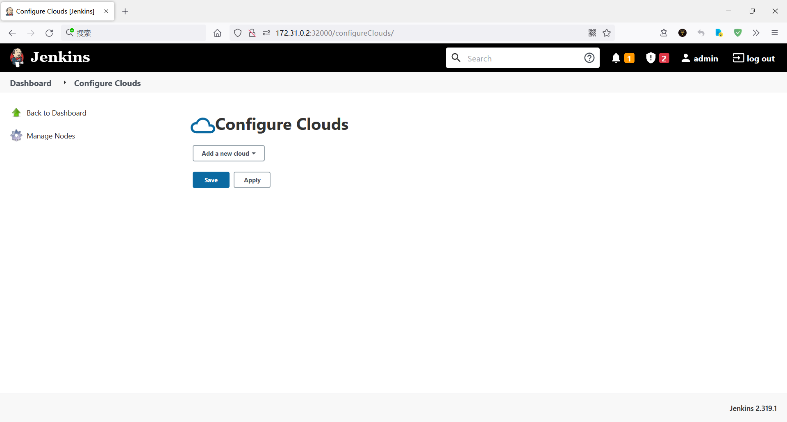
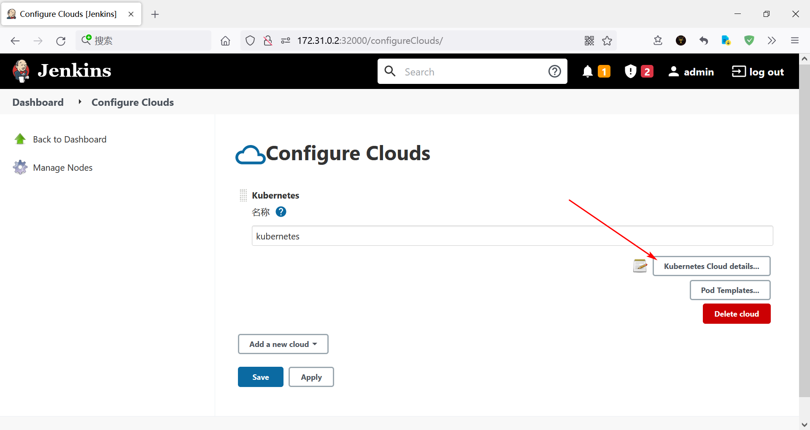
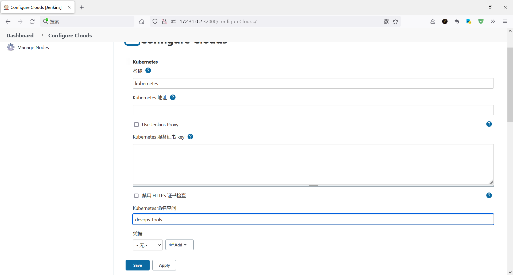
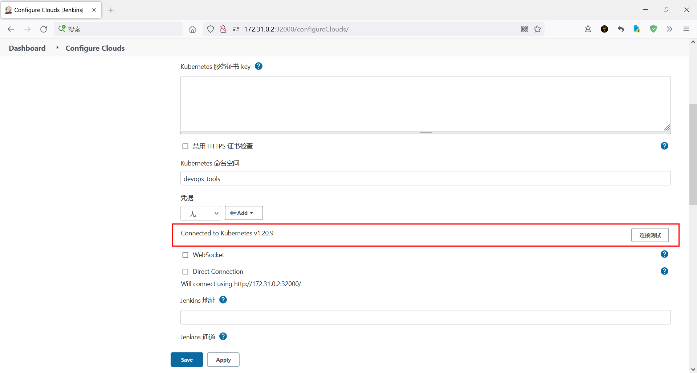
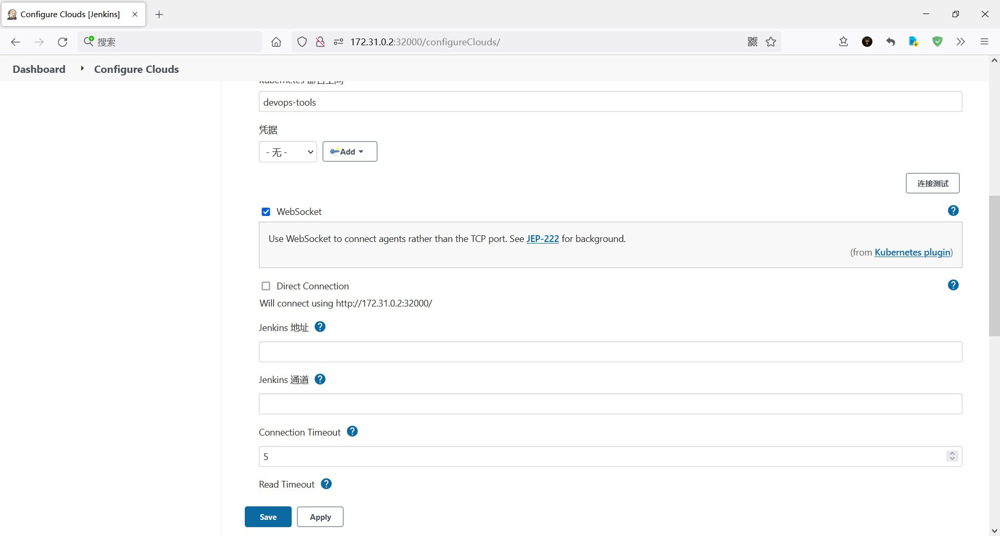

# 摘要

首先，我参考 [How To Setup Jenkins On Kubernetes Cluster.html](assets\references\How To Setup Jenkins On Kubernetes Cluster.html) （资料 [kubernetes-jenkins.7z](assets\data\kubernetes-jenkins.7z) ）在 Kubernetes 中搭建了集群，然后，我参考 [How-to-Use-Kubernetes-Pods-As-Jenkins-Agents.md](assets\references\How-to-Use-Kubernetes-Pods-As-Jenkins-Agents.md) （内含视频）使用 Jenkins 运行了 job

# kubernetes 搭建 Jenkins 集群

不废话了， [How To Setup Jenkins On Kubernetes Cluster.html](assets\references\How To Setup Jenkins On Kubernetes Cluster.html) 说得很清楚了，这里做出说明：

1.  本文 Jenkins 所在 namespace 是 **devops-tools** 

# 使用 Jenkins 

参考 [How-to-Use-Kubernetes-Pods-As-Jenkins-Agents.md](assets\references\How-to-Use-Kubernetes-Pods-As-Jenkins-Agents.md) （内含视频）

## 安装插件

安装名为  **kubernetes** 的插件

## 移除所有在 controller 的 executor

### 进入管理界面

在主界面依次点击： Manage Jenkins → Manage Nodes and Clouds ，你会看见：



然后依次点击： **Built-In Node** （名字可能不一样，但应该是差不多的）→ Configure 



### 移除所有在 controller 的 executor

1. Number of executors：填 **0** 就好
2. Labels：随便，我乱写的
3. Usage：选择 **Only build jobs with label expressions matching this node** 



## add a new clouds

### 进入管理界面

回到主界面，然后依次点击： Manage Jenkins → Manage Nodes and Clouds ，你会看见：


点击 Configure Clouds，你会看见：



### add a new clouds


### kubernetes 命名空间

点击 **Kubernetes Cloud details...** ，配置命名空间



上面我们部署 Jenkins 的时候命名空间为 **devops-tools** ，所以我们填 **devops-tools** 



### 连接测试

由于我们的 Jenkins 是在 kubernetes 内部署的，因此我们天生就连上了，不需要额外的配置，直接测试连接，马上就连上了



如果你想把 Jenkins 部署在 kubernetes 集群外部，我建议参考：

-  [How-to-Use-Kubernetes-Pods-As-Jenkins-Agents.md](assets\references\How-to-Use-Kubernetes-Pods-As-Jenkins-Agents.md) （内含视频）
- [How To Setup Jenkins Build Agents On Kubernetes Pods.html](assets\references\How To Setup Jenkins Build Agents On Kubernetes Pods.html) 

### 启用 WebSocket

[How-to-Use-Kubernetes-Pods-As-Jenkins-Agents.md](assets\references\How-to-Use-Kubernetes-Pods-As-Jenkins-Agents.md) 里的视频说了，但我听不懂，所以我也不知道为啥。总之启用就对了，不启用这个，会报下面的错误：

```
SEVERE: http://172.31.0.2:32000/ provided port:50000 is not reachable
java.io.IOException: http://172.31.0.2:32000/ provided port:50000 is not reachable
	at org.jenkinsci.remoting.engine.JnlpAgentEndpointResolver.resolve(JnlpAgentEndpointResolver.java:311)
	at hudson.remoting.Engine.innerRun(Engine.java:724)
	at hudson.remoting.Engine.run(Engine.java:540)
```




## Jenkins job

新建一个 **Pipeline** job，粘贴下面的 Pipeline 脚本，然后 **Build Now** 

```groovy
pipeline {
  agent {
    kubernetes {
      yaml '''
        apiVersion: v1
        kind: Pod
        spec:
          containers:
          - name: maven
            image: maven:alpine
            command:
            - cat
            tty: true
        '''
    }
  }
  stages {
    stage('Run maven') {
      steps {
        container('maven') {
          sh 'mvn -version'
        }
      }
    }
  }
}
```

下面是控制台输出：

```
Started by user admin
[Pipeline] Start of Pipeline
[Pipeline] podTemplate
[Pipeline] {
[Pipeline] node
Created Pod: kubernetes devops-tools/k8s-jenkins-7-4d3k0-hlk8l-0nwqd
[Normal][devops-tools/k8s-jenkins-7-4d3k0-hlk8l-0nwqd][Scheduled] Successfully assigned devops-tools/k8s-jenkins-7-4d3k0-hlk8l-0nwqd to k8s-node2
[Normal][devops-tools/k8s-jenkins-7-4d3k0-hlk8l-0nwqd][Pulled] Container image "maven:alpine" already present on machine
[Normal][devops-tools/k8s-jenkins-7-4d3k0-hlk8l-0nwqd][Created] Created container maven
[Normal][devops-tools/k8s-jenkins-7-4d3k0-hlk8l-0nwqd][Started] Started container maven
[Normal][devops-tools/k8s-jenkins-7-4d3k0-hlk8l-0nwqd][Pulled] Container image "jenkins/inbound-agent:4.11-1-jdk11" already present on machine
[Normal][devops-tools/k8s-jenkins-7-4d3k0-hlk8l-0nwqd][Created] Created container jnlp
[Normal][devops-tools/k8s-jenkins-7-4d3k0-hlk8l-0nwqd][Started] Started container jnlp
Agent k8s-jenkins-7-4d3k0-hlk8l-0nwqd is provisioned from template k8s-jenkins_7-4d3k0-hlk8l
---
apiVersion: "v1"
kind: "Pod"
metadata:
  annotations:
    buildUrl: "http://172.31.0.2:32000/job/k8s-jenkins/7/"
    runUrl: "job/k8s-jenkins/7/"
  labels:
    jenkins: "slave"
    jenkins/label-digest: "9925a6e7f3d8aaae32ab958738b8252367270007"
    jenkins/label: "k8s-jenkins_7-4d3k0"
  name: "k8s-jenkins-7-4d3k0-hlk8l-0nwqd"
spec:
  containers:
  - command:
    - "cat"
    image: "maven:alpine"
    name: "maven"
    tty: true
    volumeMounts:
    - mountPath: "/home/jenkins/agent"
      name: "workspace-volume"
      readOnly: false
  - env:
    - name: "JENKINS_SECRET"
      value: "********"
    - name: "JENKINS_AGENT_NAME"
      value: "k8s-jenkins-7-4d3k0-hlk8l-0nwqd"
    - name: "JENKINS_WEB_SOCKET"
      value: "true"
    - name: "JENKINS_NAME"
      value: "k8s-jenkins-7-4d3k0-hlk8l-0nwqd"
    - name: "JENKINS_AGENT_WORKDIR"
      value: "/home/jenkins/agent"
    - name: "JENKINS_URL"
      value: "http://172.31.0.2:32000/"
    image: "jenkins/inbound-agent:4.11-1-jdk11"
    name: "jnlp"
    resources:
      limits: {}
      requests:
        memory: "256Mi"
        cpu: "100m"
    volumeMounts:
    - mountPath: "/home/jenkins/agent"
      name: "workspace-volume"
      readOnly: false
  nodeSelector:
    kubernetes.io/os: "linux"
  restartPolicy: "Never"
  volumes:
  - emptyDir:
      medium: ""
    name: "workspace-volume"

Running on k8s-jenkins-7-4d3k0-hlk8l-0nwqd in /home/jenkins/agent/workspace/k8s-jenkins
[Pipeline] {
[Pipeline] stage
[Pipeline] { (Run maven)
[Pipeline] container
[Pipeline] {
[Pipeline] sh
+ mvn -version
Apache Maven 3.6.1 (d66c9c0b3152b2e69ee9bac180bb8fcc8e6af555; 2019-04-04T19:00:29Z)
Maven home: /usr/share/maven
Java version: 1.8.0_212, vendor: IcedTea, runtime: /usr/lib/jvm/java-1.8-openjdk/jre
Default locale: en_US, platform encoding: UTF-8
OS name: "linux", version: "3.10.0-1160.59.1.el7.x86_64", arch: "amd64", family: "unix"
[Pipeline] }
[Pipeline] // container
[Pipeline] }
[Pipeline] // stage
[Pipeline] }
[Pipeline] // node
[Pipeline] }
[Pipeline] // podTemplate
[Pipeline] End of Pipeline
Finished: SUCCESS
```


