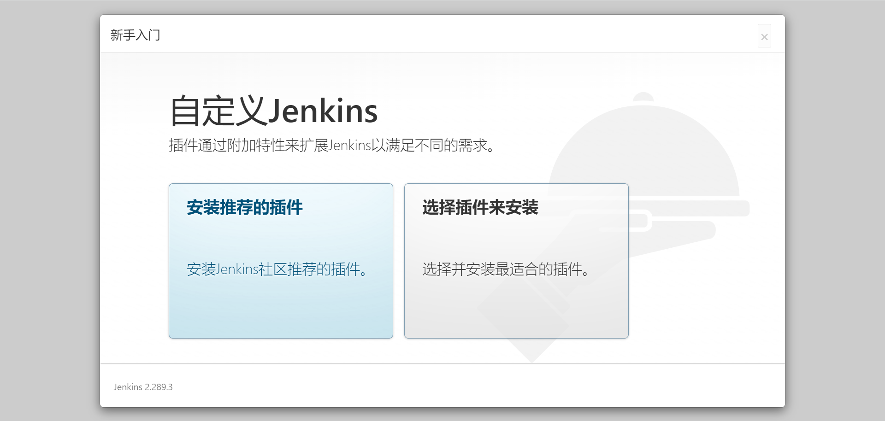

# 摘要

jenkins-2.289.3 的安装与启动

# 虚拟机准备

- 系统：CentOS Linux release 7.9.2009 (Core)
- IP 地址：192.168.19.10
- 内存：8G

# 安装Jenkins

## 安装 jdk

jenkins 基于Java ，所以这里需要安装 jdk 

### 下载

这里我选择 jdk-8u161-linux-x64.tar.gz | [下载地址](https://www.oracle.com/java/technologies/javase/javase8-archive-downloads.html) 

### 安装

这里就说一点：**把 jdk 安装到指定路径** 。下面是 **jdk-11.0.12_linux-x64_bin.tar.gz** 安装脚本，把 **jdk-11.0.12_linux-x64_bin.tar.gz** 上传到虚拟机，粘贴以下命令即可：

```sh
# 这个路径是 jenkins 的默认 jdk 路径之一,如果你把 jdk 装在这个目录下,后面就不用改配置文件了
JDK_FOR_JENKINS=/usr/lib/jvm/java-1.8.0/bin/java
# 创建 jdk 存放目录
mkdir -p ${JDK_FOR_JENKINS}
# 解压 jdk-8u161-linux-x64.tar.gz
tar -zxvf jdk-8u161-linux-x64.tar.gz
# 移动到 jenkins 的默认 jdk 路径
mv jdk1.8.0_161/* ${JDK_FOR_JENKINS} && rmdir jdk1.8.0_161
# 配置环境变量
cp /etc/profile /etc/profile.backup
echo "JAVA_HOME=${JDK_FOR_JENKINS}" >> /etc/profile
echo "JRE_HOME=\${JAVA_HOME}/jre" >> /etc/profile
echo "CLASSPATH=.:\${JAVA_HOME}/lib:\${JRE_HOME}/lib" >> /etc/profile
echo "PATH=\$PATH:\${JAVA_HOME}/bin:\${JRE_HOME}/bin" >> /etc/profile

# 重新加载 /etc/profile
source /etc/profile
# 查看是否安装完成
java -version
```

如果你想把 jdk 安装在其他位置，那么你就要修改配置文件 `/etc/init.d/jenkins` ，添加 JAVA_HOME

## Jenkins 安装与启动

### 下载

这里我选择 ：jenkins-2.289.3-1.1.noarch.rpm | [直接下载](https://github.com/jenkinsci/jenkins/releases/download/jenkins-2.289.3/jenkins-2.289.3-1.1.noarch.rpm) | [下载页面](https://github.com/jenkinsci/jenkins/releases/tag/jenkins-2.289.3) 

### 安装依赖

```sh
yum install fontconfig-2.13.0-4.3.el7.x86_64 -y
```

### 安装 jenkins 

将 jenkins-2.289.3-1.1.noarch.rpm 上传到虚拟机，然后执行下面的安装命令：

```sh
rpm -ivh jenkins-2.289.3-1.1.noarch.rpm 
```

不出意外，你可以看到下面的安装过程：

```
[root@localhost ~]# ls jenkins*
jenkins-2.289.3-1.1.noarch.rpm
[root@localhost ~]# 
[root@localhost ~]# rpm -ivh jenkins-2.289.3-1.1.noarch.rpm 
warning: jenkins-2.289.3-1.1.noarch.rpm: Header V4 RSA/SHA512 Signature, key ID 45f2c3d5: NOKEY
Preparing...                          ################################# [100%]
Updating / installing...
   1:jenkins-2.289.3-1.1              ################################# [100%]
[root@localhost ~]#
```

### 启动 jenkins 

执行以下命令启动 jenkins ，此处说明两个问题：

1. 如果你没有把 jdk 安装在 jenkins 默认 jdk 路径上，那你就需要修改配置文件，否则此处启动失败
2. jenkins 默认端口是8080 ，这里懒得改 jenkins 端口了，直接用默认的。想改的话修改 `/etc/sysconfig/jenkins` 中的 `JENKINS_PORT="8080"` 即可

```sh
systemctl start jenkins
```

# 访问 Jenkins 

## Jenkins 地址

jenkins 的默认端口是 8080 ，访问地址则是 http://ipaddress/8080 。这里我的 ip 地址是 192.168.19.10 ，那么我应该访问 http://192.168.19.10:8080 。访问 jenkins 出现下面的页面是正常的，这表示 jenkins 正在启动，多等等就行


## 解锁 Jenkins

初次进入 Jenkins 需要管理员密码，根据提示，管理员密码在服务器的 `/var/lib/jenkins/secrets/initialAdminPassword` 中。在服务器上查看管理员密码并输入到页面中，在页面中点击 **继续** 即可进入 jenkins 

```sh
[root@localhost ~]# cat /var/lib/jenkins/secrets/initialAdminPassword
5e09b6d3b76d40fd9511418eb002c868
[root@localhost ~]# 
```

## 插件下载



这里我们先不下载任何插件，这里我们执行三步：

1. 选择右边的 **选择插件来安装** 
2. 点击左上角的 **无** 
3. 点击安装

这里出问题了也不要紧，就是插件的安装而已，不会对后面的操作产生影响，大胆操作！

## 创建第一个管理员账户

这个地方简单了，就设个账号而已。这里我四个框都填了 `admin` 

## 保存并完成

直接点击右下角 **保存并完成** 即可，登录进去后可看到如下界面


