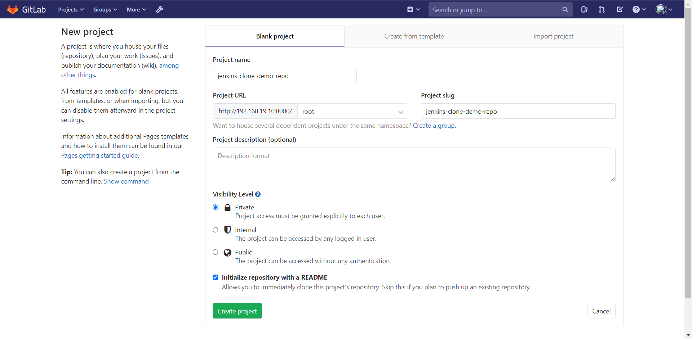
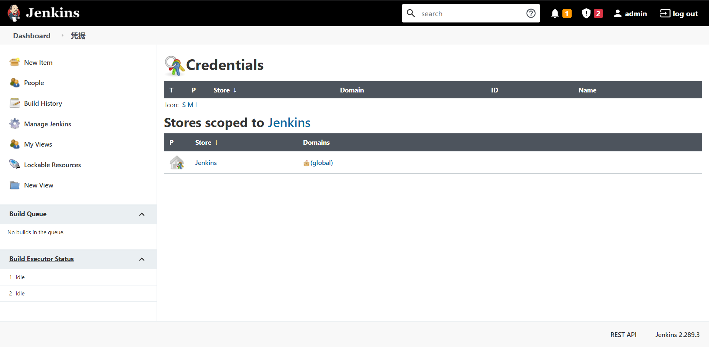
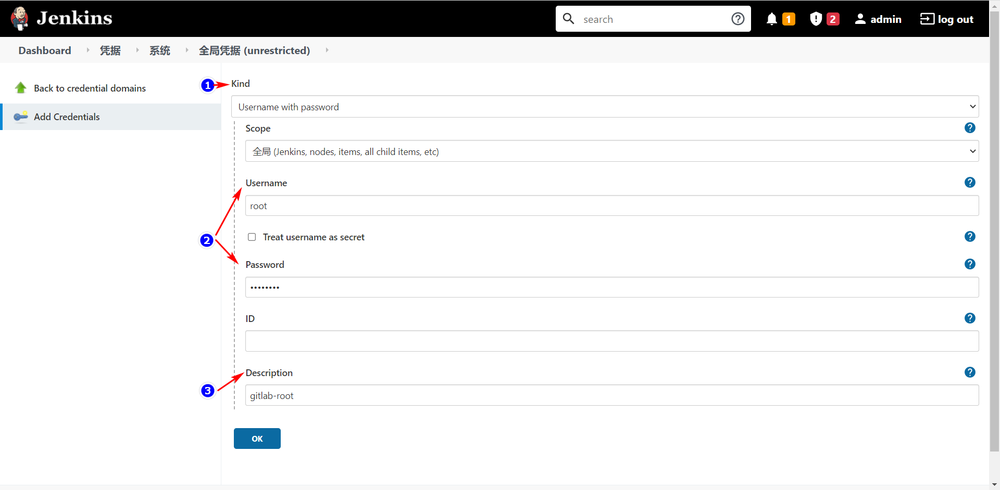
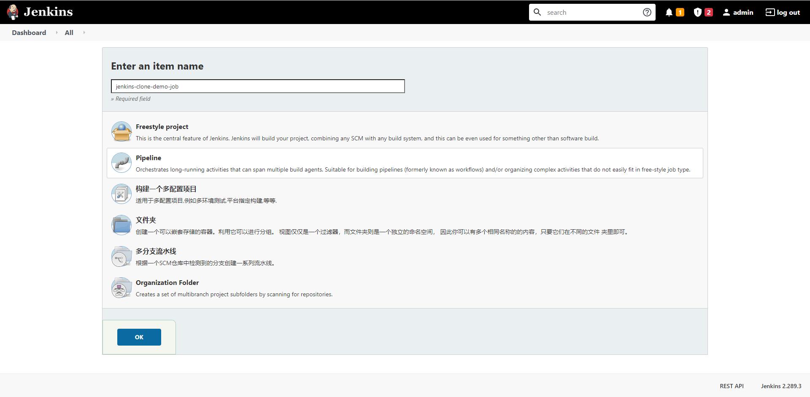
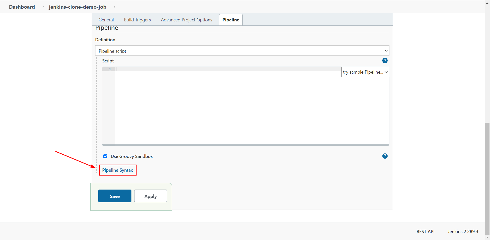

---

title: jenkins-clone-repo-by-pipeline
tags: 
date: 2022-01-15 15:40:03
id: 1642232403144740200
---
# 摘要

jenkins 使用 pipeline 克隆仓库

# 环境准备

## jenkins

安装好 jenkins-2.289.3 

## gitlab

想要 clone 代码，那代码总得有个地方放吧。你可能想到了 GitHub ，这确实是一种方案，但估计没有哪家公司会把自家的机密代码放到 GitHub 上，因此这里的代码仓库我们选择 **gitlab-ce:12.4.2-ce.0** 。gitlab 自行安装，这里不过多赘述

#  git 仓库准备

## Create a project

到 gitlab 中创建一个 **jenkins-clone-demo-repo** 仓库，顺便勾选 **Initialize repository with a README** ：

# Jenkins clone 仓库

## 安装插件 

| name     | version | 安装位置           |
| -------- | ------- | ------------------ |
| Pipeline | 2.6     | Jenkins 插件       |
| Git      | 4.10.2  | Jenkins 插件       |
| git      | 1.8.3.1 | Jenkins 所在服务器 |

## 添加凭据

### 添加凭据界面

Manage Jenkins → Manage Credentials → 添加凭据

### 添加凭据

1. 选择凭据种类：Username with password
2. 输入账号密码
3. （非必须）输入描述

## 创建 job

## 创建脚本

### 进入 Pipeline Syntax

### 片段生成器代码生成 clone 片段

1. 选择 **checkout: Check out from version control**
2. 选择 git
3. 输入被拉取代码所在仓库。这个地方不要手动敲，要到 gitlab 仓库复制
4. 选择进入被拉取代码所需的凭证
5. 生成代码片段

