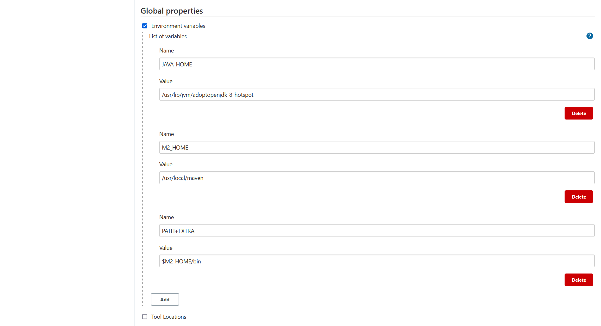

# 摘要

Jenkins 中使用 maven 打包 spring boot 项目

# 准备工作

## 实验条件

- jenkins-2.289.3 
- gitlab-ce_12.4.2-ce.0 
- [apache-maven-3.6.3-bin.tar.gz](https://dlcdn.apache.org/maven/maven-3/3.6.3/binaries/apache-maven-3.6.3-bin.tar.gz) 

## 前置知识

-  Jenkins 使用 pipeline clone gitlab 上的代码

# hello-springboot

准备一个 spring boot 的 hello world 项目即可

## 创建 spring boot 的 hello world 项目

### 创建项目

IDEA 中使用 [spring initializer](https://start.spring.io/) 创建项目，选择 **2.3.2.RELEASE** 版本（创建完了再改也行），勾选 **Web → Spring Web** ，路径选择 clone 下来的项目

### HelloController.java

创建一个 controller 就够了

```java
@RestController
public class HelloController {
    @GetMapping("hello")
    public String hello(){
        return "hello spring boot!";
    }
}
```

## push 到远程仓库

上面的项目为一个仓库，push 到远程仓库

# Jenkins 安装配置 maven

## 宿主机 maven 安装

### 安装

就正常安装，没什么特别的

```sh
# 下载 maven 并解压
curl -O https://dlcdn.apache.org/maven/maven-3/3.6.3/binaries/apache-maven-3.6.3-bin.tar.gz
tar -xvf apache-maven-3.6.3-bin.tar.gz
mkdir -p /usr/local/maven && mv apache-maven-3.6.3/* /usr/local/maven
# 配置 MAVEN_HOME 
echo 'export MAVEN_HOME=/usr/local/maven' >> /etc/profile
echo 'export PATH=${PATH}:${MAVEN_HOME}/bin' >> /etc/profile
source /etc/profile
# 查看是否安装完成
mvn -v

```

### mirror

国内惯例，编辑 `comf/settings.xml` 配置阿里云镜像

```xml
... ...
<mirrors>
      ... ...
    <mirror>  
      <id>alimaven</id>  
      <name>aliyun maven</name>  
      <url>http://maven.aliyun.com/nexus/content/groups/public/</url>  
      <mirrorOf>central</mirrorOf>          
    </mirror> 
  </mirrors>
... ...
```

### localRepository

国际惯例， 编辑 `comf/settings.xml` 配置 maven 仓库路径

```xml
  <localRepository>/usr/local/maven_repository</localRepository>
```

## Jenkins 整合 maven

### 安装插件

| Name                                                         | Version |
| :----------------------------------------------------------- | :------ |
| [ Maven Integration](https://plugins.jenkins.io/maven-plugin) | 3.16    |

### Configure System 

进入 Manage Jenkins → Configure System 


| key        | value                               |
| ---------- | ----------------------------------- |
| JAVA_HOME  | /usr/lib/jvm/adoptopenjdk-8-hotspot |
| M2_HOME    | /usr/local/maven                    |
| PATH+EXTRA | $M2_HOME/bin                        |



# pipeline

## script 

创建名为 springboot-package-by-maven-demo-job 的 pipeline 、 clone 代码之类的不废话了，直接给出最终 script ：

```groovy
pipeline {
    agent any

    stages {
        stage('clone') {
            steps {
                checkout([$class: 'GitSCM', branches: [[name: '*/master']], extensions: [], userRemoteConfigs: [[credentialsId: '0d41310d-a4b9-4c28-bc22-c28849deda15', url: 'http://192.168.19.10:8000/root/hello-springboot.git']]])
            }
        }
        stage('package') {
            steps {
                sh label: '', script: 'mvn clean package'
            }
        }
    }
}

```

## 打包结果

在 **${JENKINS_HOME}/workspace/springboot-package-by-maven-demo-job/target** 目录下，你应该可以看到 **hello-springboot-0.0.1-SNAPSHOT.jar** 文件，这就是打包好的 spring boot 项目


